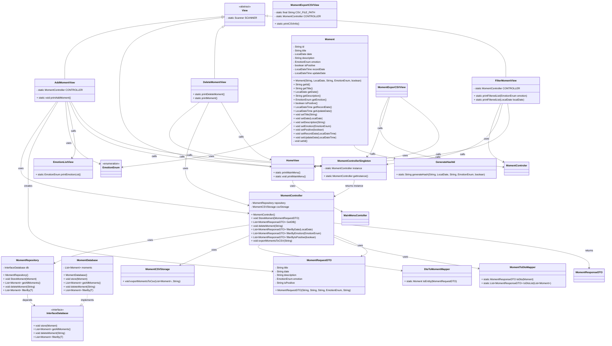

# Inside Out Diary

[](https://www.oracle.com/java/)
[](https://junit.org/junit5/)
[](https://maven.apache.org/)
[](#)

## 📖 Project Description

This project is a console-based application for managing a personal diary of moments and movies.  
It allows users to record, view, and delete memories, each associated with an emotion and a specific date.

Additionally, the app supports movie tracking, giving users the option to register watched movies either manually or by fetching details from an external API.

The main goal of this application is to be a simple yet practical tool for users to record, revisit, and organize their experiences and entertainment history.

---

### 📝 Structure of a Moment

Each diary moment consists of the following information:

- **ID**
- **Title**
- **Description**
- **Emotion** (one of 10 predefined)
- **Date of the moment**
- **Creation date**
- **Last modification date**
- **Good/Bad moment indicator**

---

### 🎬 Structure of a Movie

Each registered movie contains the following information:

- **ImdbId**
- **Title**
- **Genre(s)**
- **Emotion** (what it made the user feel)
- **Release year**
- **Creation date**

---

### ⚡ Core Features

- **➕ Add a moment**: Register a new memory with all its details.
- **👀 View moments**: Retrieve and display the full list of saved moments.
- **🗑️ Delete a moment**: Remove a diary entry to keep it organized.
- **🔍 Filter moments**: Search for specific moments by emotion or date.
- **💡 Distinguish good and bad moments**: Mark each entry accordingly.
- **📂 Export moments to CSV**: Generate a CSV file with all recorded memories.
- **🎬 Add a movie**: Two options available:
  - **Medium Difficulty**: Provide the IMDb ID, fetch data from an API.
  - **Manual Input**: Enter IMDb ID, title, genre(s), associated emotion, and release year.
- **📂 Save movies in CSV**: Movies are only stored in a CSV file.
- **🔍 Filter movies by genre**: View only the movies belonging to a specific genre.
- **👀 View movie list**: Display all registered movies.
- **🗑️ Delete a movie**: Remove a registered movie from the CSV.
- **🚪 Exit the program**: End execution of the application.

---

## 🚀 Installation

### Prerequisites

- Java 17 or higher
- Maven 3.6+ (optional, if using Maven)
- Git

### Installation Steps

#### 1. Clone the repository

```bash
git clone https://github.com/dmbiee/project-java-consoleapp-inside-out.git
cd project-java-consoleapp-inside-out
```

#### 2. Compile the project

With Maven:

```bash
mvn clean compile
```

With Java directly:

```bash
javac -d bin -cp src src/dev/jesus/**/*.java
```

Generate executable JAR (Maven):

```bash
mvn clean package
```

#### 3. Run the project

With executable JAR:

```bash
java -cp "target/classes" dev.jesus.App
```

### Execution

Once compiled, the application will run in the console and display the main diary menu.

---

## 🧪 Testing

The project uses JUnit 5.12 for unit testing, System Rules by Stefan Birkner for view testing, and Mockito for controllers.

Example of test coverage:


---

## 🎨 Design

####




---

### 🏗️ Implemented Design Patterns

#### MVC (Model-View-Controller)

- **Controllers**: HomeController, MomentController, MovieController – Business logic
- **Views**: User interface inheriting from abstract `View` class
- **Models**: Moment, Movie, EmotionEnum – Domain entities

#### Repository Pattern

- **Interface**: `InterfaceDB` – Data access contract
- **Implementation**: `DiaryDatabase` – In-memory storage
- **Repository**: `MomentRepository` – Abstraction layer

#### Singleton Pattern

- **MomentControllerSingleton** – Single instance of controller
- **MomentRepositorySingleton** – Single instance of repository

#### DTO Pattern

- **MomentDTO** – Input data transfer
- **MomentViewDTO** – View data transfer
- **MomentFilterDTO** – Filtering data
- **MovieDTO** – Data transfer for movies

#### Mapper Pattern

- **MomentMapper** – Entity ↔ DTO conversion
- **MovieMapper** – Entity ↔ DTO conversion

---

### 🔄 Execution Flow

- **Initialization**: App → HomeController → HomeView
- **Interaction**: User selects option → Specific View
- **Processing**: View → ControllerSingleton → Controller
- **Persistence**: Controller → Repository → Database/CSV
- **Conversion**: Mappers handle transformation between DTOs and entities

---

### ✨ Highlighted Features

#### Smart Enums

- **EmotionEnum**: 10 predefined emotions with conversion methods
- **HomeOptionEnum**: Menu with integrated lambda functions
- **FilterOptionEnum**: Typed filtering options

#### Structured Inheritance

- All views inherit from abstract class `View`
- Shared scanner for user input
- Code reuse for common features

#### Clear Separation of Responsibilities

- **Controllers**: Business logic only
- **Views**: Presentation and user interaction
- **Repositories**: Data access only
- **Mappers**: Data conversion only
